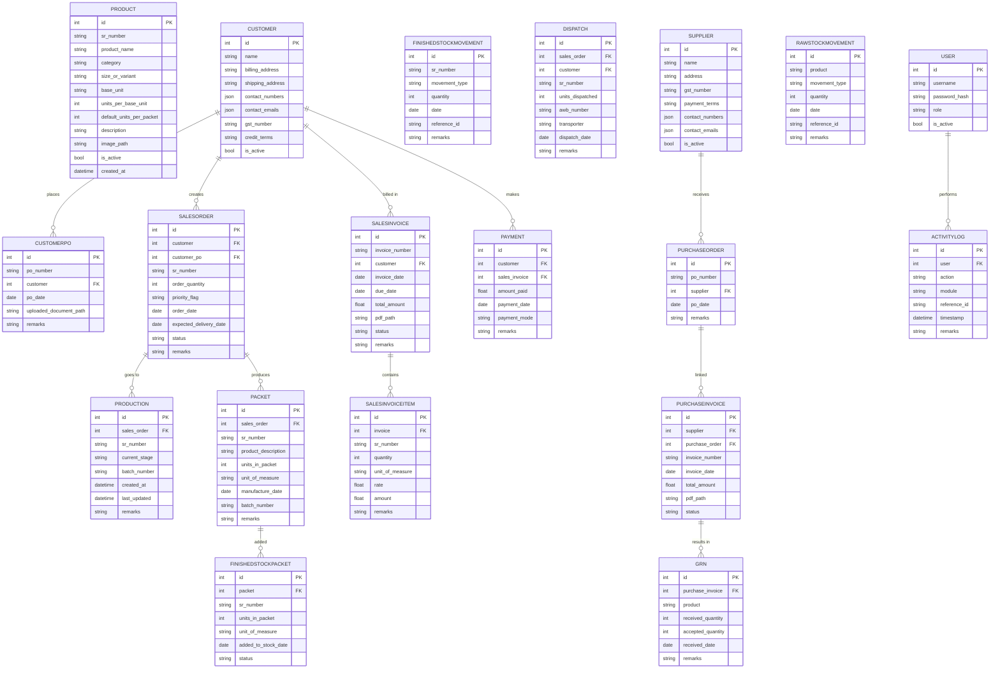

```mermaid
erDiagram

    PRODUCT {
        int id PK
        string sr_number
        string product_name
        string category
        string size_or_variant
        string base_unit
        int units_per_base_unit
        int default_units_per_packet
        string description
        string image_path
        bool is_active
        datetime created_at
    }

    CUSTOMER {
        int id PK
        string name
        string billing_address
        string shipping_address
        json contact_numbers
        json contact_emails
        string gst_number
        string credit_terms
        bool is_active
    }

    CUSTOMERPO {
        int id PK
        string po_number
        int customer FK
        date po_date
        string uploaded_document_path
        string remarks
    }

    SALESORDER {
        int id PK
        int customer FK
        int customer_po FK
        string sr_number
        int order_quantity
        string priority_flag
        date order_date
        date expected_delivery_date
        string status
        string remarks
    }

    PRODUCTION {
        int id PK
        int sales_order FK
        string sr_number
        string current_stage
        string batch_number
        datetime created_at
        datetime last_updated
        string remarks
    }

    PACKET {
        int id PK
        int sales_order FK
        string sr_number
        string product_description
        int units_in_packet
        string unit_of_measure
        date manufacture_date
        string batch_number
        string remarks
    }

    FINISHEDSTOCKPACKET {
        int id PK
        int packet FK
        string sr_number
        int units_in_packet
        string unit_of_measure
        date added_to_stock_date
        string status
    }

    FINISHEDSTOCKMOVEMENT {
        int id PK
        string sr_number
        string movement_type
        int quantity
        date date
        string reference_id
        string remarks
    }

    DISPATCH {
        int id PK
        int sales_order FK
        int customer FK
        string sr_number
        int units_dispatched
        string awb_number
        string transporter
        date dispatch_date
        string remarks
    }

    SALESINVOICE {
        int id PK
        string invoice_number
        int customer FK
        date invoice_date
        date due_date
        float total_amount
        string pdf_path
        string status
        string remarks
    }

    SALESINVOICEITEM {
        int id PK
        int invoice FK
        string sr_number
        int quantity
        string unit_of_measure
        float rate
        float amount
        string remarks
    }

    PAYMENT {
        int id PK
        int customer FK
        int sales_invoice FK
        float amount_paid
        date payment_date
        string payment_mode
        string remarks
    }

    SUPPLIER {
        int id PK
        string name
        string address
        string gst_number
        string payment_terms
        json contact_numbers
        json contact_emails
        bool is_active
    }

    PURCHASEORDER {
        int id PK
        string po_number
        int supplier FK
        date po_date
        string remarks
    }

    PURCHASEINVOICE {
        int id PK
        int supplier FK
        int purchase_order FK
        string invoice_number
        date invoice_date
        float total_amount
        string pdf_path
        string status
    }

    GRN {
        int id PK
        int purchase_invoice FK
        string product
        int received_quantity
        int accepted_quantity
        date received_date
        string remarks
    }

    RAWSTOCKMOVEMENT {
        int id PK
        string product
        string movement_type
        int quantity
        date date
        string reference_id
        string remarks
    }

    USER {
        int id PK
        string username
        string password_hash
        string role
        bool is_active
    }

    ACTIVITYLOG {
        int id PK
        int user FK
        string action
        string module
        string reference_id
        datetime timestamp
        string remarks
    }


    CUSTOMER ||--o{ CUSTOMERPO : "places"
    CUSTOMER ||--o{ SALESORDER : "creates"
    CUSTOMER ||--o{ SALESINVOICE : "billed in"
    CUSTOMER ||--o{ PAYMENT : "makes"
    SALESORDER ||--o{ PRODUCTION : "goes to"
    SALESORDER ||--o{ PACKET : "produces"
    PACKET ||--o{ FINISHEDSTOCKPACKET : "added"
    SALESINVOICE ||--o{ SALESINVOICEITEM : "contains"
    SUPPLIER ||--o{ PURCHASEORDER : "receives"
    PURCHASEORDER ||--o{ PURCHASEINVOICE : "linked"
    PURCHASEINVOICE ||--o{ GRN : "results in"
    USER ||--o{ ACTIVITYLOG : "performs"
```