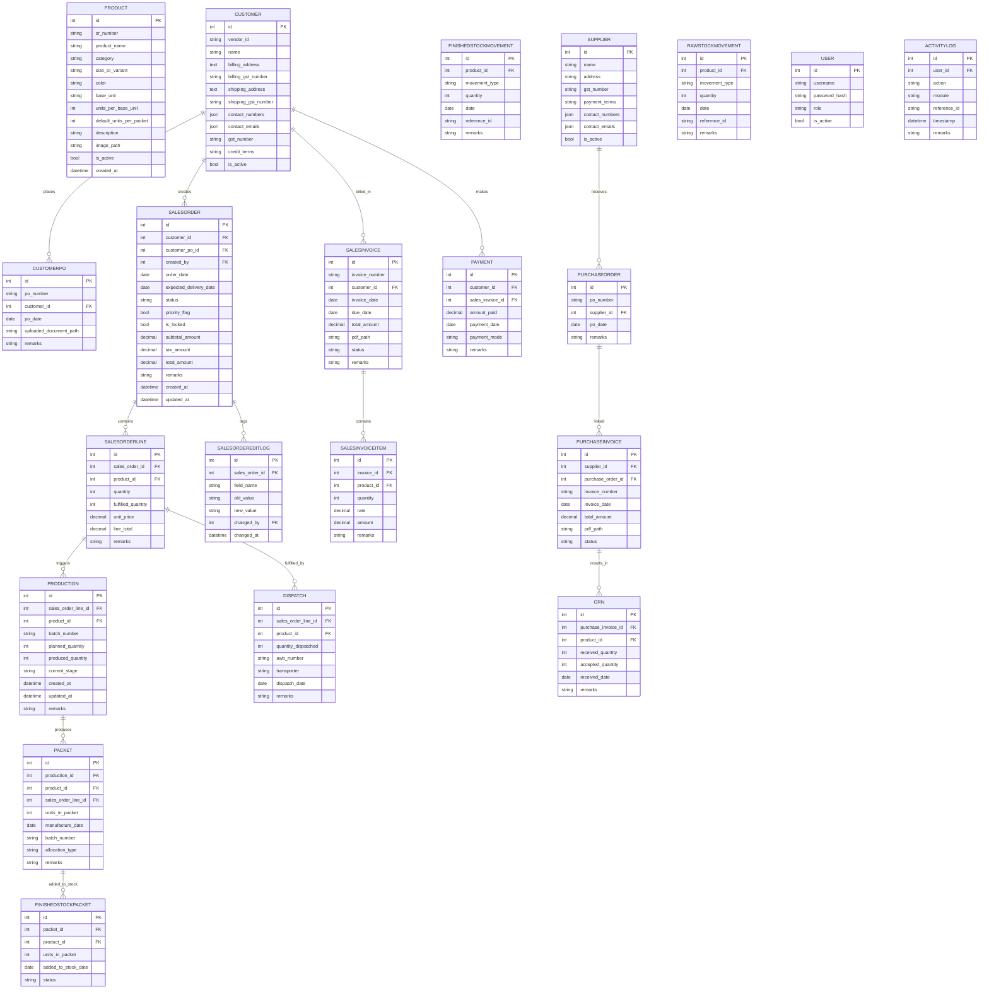

```mermaid
erDiagram

    PRODUCT {
        int id PK
        string sr_number
        string product_name
        string category
        string size_or_variant
        string color
        string base_unit
        int units_per_base_unit
        int default_units_per_packet
        string description
        string image_path
        bool is_active
        datetime created_at
    }

    CUSTOMER {
        int id PK
        string vendor_id
        string name
        text billing_address
        string billing_gst_number
        text shipping_address
        string shipping_gst_number
        json contact_numbers
        json contact_emails
        string gst_number
        string credit_terms
        bool is_active
    }

    CUSTOMERPO {
        int id PK
        string po_number
        int customer_id FK
        date po_date
        string uploaded_document_path
        string remarks
    }

    SALESORDER {
        int id PK
        int customer_id FK
        int customer_po_id FK
        int created_by FK
        date order_date
        date expected_delivery_date
        string status
        bool priority_flag
        bool is_locked
        decimal subtotal_amount
        decimal tax_amount
        decimal total_amount
        string remarks
        datetime created_at
        datetime updated_at
    }

    SALESORDERLINE {
        int id PK
        int sales_order_id FK
        int product_id FK
        int quantity
        int fulfilled_quantity
        decimal unit_price
        decimal line_total
        string remarks
    }

    SALESORDEREDITLOG {
        int id PK
        int sales_order_id FK
        string field_name
        string old_value
        string new_value
        int changed_by FK
        datetime changed_at
    }

    PRODUCTION {
        int id PK
        int sales_order_line_id FK
        int product_id FK
        string batch_number
        int planned_quantity
        int produced_quantity
        string current_stage
        datetime created_at
        datetime updated_at
        string remarks
    }

    PACKET {
        int id PK
        int production_id FK
        int product_id FK
        int sales_order_line_id FK
        int units_in_packet
        date manufacture_date
        string batch_number
        string allocation_type
        string remarks
    }

    FINISHEDSTOCKPACKET {
        int id PK
        int packet_id FK
        int product_id FK
        int units_in_packet
        date added_to_stock_date
        string status
    }

    FINISHEDSTOCKMOVEMENT {
        int id PK
        int product_id FK
        string movement_type
        int quantity
        date date
        string reference_id
        string remarks
    }

    DISPATCH {
        int id PK
        int sales_order_line_id FK
        int product_id FK
        int quantity_dispatched
        string awb_number
        string transporter
        date dispatch_date
        string remarks
    }

    SALESINVOICE {
        int id PK
        string invoice_number
        int customer_id FK
        date invoice_date
        date due_date
        decimal total_amount
        string pdf_path
        string status
        string remarks
    }

    SALESINVOICEITEM {
        int id PK
        int invoice_id FK
        int product_id FK
        int quantity
        decimal rate
        decimal amount
        string remarks
    }

    PAYMENT {
        int id PK
        int customer_id FK
        int sales_invoice_id FK
        decimal amount_paid
        date payment_date
        string payment_mode
        string remarks
    }

    SUPPLIER {
        int id PK
        string name
        string address
        string gst_number
        string payment_terms
        json contact_numbers
        json contact_emails
        bool is_active
    }

    PURCHASEORDER {
        int id PK
        string po_number
        int supplier_id FK
        date po_date
        string remarks
    }

    PURCHASEINVOICE {
        int id PK
        int supplier_id FK
        int purchase_order_id FK
        string invoice_number
        date invoice_date
        decimal total_amount
        string pdf_path
        string status
    }

    GRN {
        int id PK
        int purchase_invoice_id FK
        int product_id FK
        int received_quantity
        int accepted_quantity
        date received_date
        string remarks
    }

    RAWSTOCKMOVEMENT {
        int id PK
        int product_id FK
        string movement_type
        int quantity
        date date
        string reference_id
        string remarks
    }

    USER {
        int id PK
        string username
        string password_hash
        string role
        bool is_active
    }

    ACTIVITYLOG {
        int id PK
        int user_id FK
        string action
        string module
        string reference_id
        datetime timestamp
        string remarks
    }

    CUSTOMER ||--o{ CUSTOMERPO : places
    CUSTOMER ||--o{ SALESORDER : creates
    CUSTOMER ||--o{ SALESINVOICE : billed_in
    CUSTOMER ||--o{ PAYMENT : makes

    SALESORDER ||--o{ SALESORDERLINE : contains
    SALESORDER ||--o{ SALESORDEREDITLOG : logs

    SALESORDERLINE ||--o{ PRODUCTION : triggers
    PRODUCTION ||--o{ PACKET : produces

    PACKET ||--o{ FINISHEDSTOCKPACKET : added_to_stock

    SALESORDERLINE ||--o{ DISPATCH : fulfilled_by

    SALESINVOICE ||--o{ SALESINVOICEITEM : contains

    SUPPLIER ||--o{ PURCHASEORDER : receives
    PURCHASEORDER ||--o{ PURCHASEINVOICE : linked
    PURCHASEINVOICE ||--o{ GRN : results_in
```